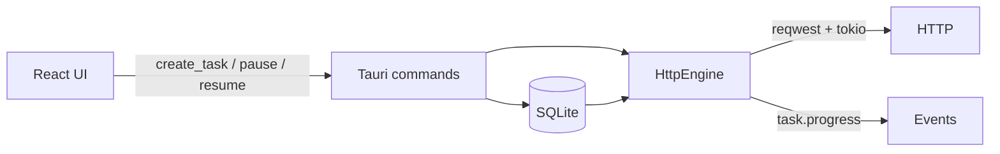

# Vibe Downloader 开发路线图

本文档描述在**基础框架**（当前仓库状态）之上的分阶段开发计划，与 [PRODUCT.md](../PRODUCT.md) 的战略优先级、[DESIGN.md](../DESIGN.md) 的体验与视觉规范对齐。

> 说明：`docs/functional-design.md` 与 `docs/ui-design-style.md` 已恢复到 `docs/`，后续计划以这两份文档、`PRODUCT.md` 与 `DESIGN.md` 共同约束。

---

## 现状快照

| 已完成 | 未完成 / 占位 |
|--------|----------------|
| Tauri 2 + React 壳层、设计 token、任务列表/详情/命令栏 UI | Range 多连接 |
| SQLite 草案 schema、`list_tasks` / mock 种子数据、单连接 `segments` 记录 | 崩溃自动继续、全局队列、限速与设置页 |
| 单连接 HTTP 下载、Range 续传校验、真实 `task.progress` 事件 | Connections 详情仍为占位 |
| Windows 自绘标题栏 + 窗口控制 | 打开文件/目录、浏览器扩展交接 |
| 新建下载、暂停/恢复/删除、重试、打开文件/目录命令 | 事件类型未完全纳入 specta event 契约 |
| `tauri-specta` 命令绑定、本地 HTTP/segments 回归测试 | L2 三平台 `tauri build` 仍需持续验证 |

---

## 阶段 0：巩固基础

**目标**：在加功能前减少技术债，避免类型漂移与平台差异。

**周期（参考）**：3–5 天

### 任务

1. **版本管理**：初始化 git，完善 `.gitignore`（`target/`、`dist/`、本地 DB 等）；可选恢复 `docs/functional-design.md`、`docs/ui-design-style.md`。
2. **类型与事件**：为 `TaskProgressPayload` 注册 `tauri-specta` events，或统一事件契约；逐步减少手写 `src/types/*` 与生成 bindings 的双轨维护。
3. **平台与壳层**：验证 Windows / macOS / Linux 标题栏；`tauri.conf` 与 runtime `decorations` 策略一致；推动 L2 `tauri build` 三平台绿。
4. **主题**：按 DESIGN 接入 `next-themes`，默认跟随系统，暗色为主要打磨目标。

### 验收

- `pnpm tauri dev` 稳定启动，`pnpm typecheck` 与 `cargo clippy -D warnings` 通过。
- 无 mock 数据时仍可空列表正常启动。

---

## 阶段 1：HTTP MVP — 单连接可下载

**对齐 PRODUCT 优先级 1**：HTTP 稳定后再扩展其他协议。

**周期（参考）**：2–3 周

### 架构示意

### 1.1 后端（Rust）

| 顺序 | 能力 | 说明 |
|------|------|------|
| 1 | **Probe** | HEAD/GET：解析 `Content-Length`、`Accept-Ranges`、`Content-Disposition`、重定向 → `final_url`、`total_size`、`supports_range` |
| 2 | **单连接下载** | 流式写入 `temp_path`；更新 `downloaded_bytes`、`speed_bps`；发 `task.progress`（**替换** demo emitter） |
| 3 | **命令** | `create_task`、`pause_task`、`resume_task`、`cancel_task`、`delete_task` |
| 4 | **状态机** | `queued → downloading → paused \| completed \| failed`（及 `retrying`、`waiting_network`、`needs_attention`） |
| 5 | **错误模型** | 可恢复 / 不可恢复；`health_summary`、`error_message` 符合 PRODUCT 文案风格 |

### 1.2 前端（React）

| 顺序 | 能力 | 说明 |
|------|------|------|
| 1 | **新建下载** | 命令栏 `+` → 对话框（URL、保存路径、文件名预览） |
| 2 | **命令栏接线** | Start / Pause / Delete 绑定选中任务与禁用态 |
| 3 | **列表真实进度** | 进度条接引擎事件；mock `seed_mock_tasks` 仅 dev 可选 |

### 验收

- 粘贴 URL 后 **5 秒内**看到进度与速度（PRODUCT Success Criteria）。
- 暂停/继续后字节数连续；失败时有明确原因与可理解文案。

---

## 阶段 2：可恢复与多连接

**对齐**：大文件断点续传、专家向细节诊断。

**周期（参考）**：2–3 周

### 任务

1. **Range 续传**：`.part` 临时文件 + `segments` 表；`etag` / `last_modified` 校验；远端变更 → `needs_attention`。
2. **多连接**：按文件大小与服务器能力分片（先固定 4–8 路）；安全合并写入与 fsync 策略。
3. **Schema 定稿**：HTTP MVP 稳定后冻结或迁移 `001_init.sql`（必要时 `002_*`）。
4. **详情面板**：Chunks 热力图、Connections 列表（先只读，再接引擎事件）。

### 验收

- 进程中断或断网恢复后，文件大小正确；对固定测试 URL 有集成测试（可选哈希校验）。

---

## 阶段 3：队列与设置

**周期（参考）**：1–2 周

### 任务

1. **全局队列**：并发数、排队顺序、全局速度上限（`settings` 表）。
2. **设置页**：默认目录、并发上限、速度限制；Sidebar「Settings」由占位改为真实页面。
3. **命令面板**：`mod+K` 注册 New / Pause / Resume / Delete / Limit speed 等（DESIGN：键盘高效，非唯一路径）。

### 验收

- 多任务时全局限速生效；常用操作可主要用键盘完成。

---

## 阶段 4：体验抛光

可与阶段 2–3 **交错**进行，按 DESIGN 逐项补齐。

- 任务行展开态；完成/错误动效（Framer，约 150–250ms）
- Toast；破坏性操作确认或撤销
- 速度历史 sparkline；磁盘/网络瓶颈文案
- 响应式：中窄窗口详情抽屉
- 无障碍：焦点环、热力图文字摘要与 tooltip

---

## 阶段 5：浏览器扩展交接

**对齐 PRODUCT 优先级 2**。建议在 HTTP + 续传可靠后启动。

**周期（参考）**：2–4 周

1. Native messaging 或本地 HTTP 服务 + 扩展「发送到 Vibe」。
2. 剪贴板监听或拖拽 URL（可选）。
3. 扩展最小权限与安装/使用说明。

---

## 当前迭代状态

**阶段 1 最小切片已完成**：

| 顺序 | 任务 | 产出 |
|------|------|------|
| 1 | `reqwest` + `create_task` + probe | 可创建真实任务行 |
| 2 | 单连接下载 + 写盘 + `task.progress` | 已移除 demo progress emitter |
| 3 | 新建下载对话框 + probe 信息 | 用户可粘贴 URL、检测元信息并开始下载 |
| 4 | `pause_task` / `resume_task` / `retry_task` | 命令栏与任务行操作可用 |
| 5 | 失败路径与 `failed` UI | 有明确原因、Retry、删除选择 |

## 下一迭代建议（阶段 2：多连接前置 → 固定分片）

Range 续传 + 单连接 segment 记录已作为阶段 2 前置切片落地；下一步进入固定分片多连接前，应先完成以下收口：

| 顺序 | 任务 | 产出 |
|------|------|------|
| 1 | 固定分片计划 | 按 total size 生成 4 路以内 segments |
| 2 | 随机写入 | 多个 Range 写入同一个临时文件不同偏移 |
| 3 | 连接摘要事件 | 为详情 Connections tab 提供只读数据 |
| 4 | 合并验收 | 文件大小与可选 hash 校验正确后 rename |
| 5 | 验证链路 | `pnpm typecheck`、`pnpm build`、`pnpm specta`、`cargo check`、`clippy`、`cargo test` 全绿 |

### 阶段 2 启动条件

- Range 续传校验、单连接 segment 记录和 Chunks 详情展示验证全绿。
- 默认并行 `cargo test` 稳定通过。
- 多连接实现不改变现有任务级命令签名。

### 刻意延后

- 浏览器扩展（阶段 5）
- 磁力 / BT 等非 HTTP 协议
- 装饰性 Mica/玻璃态大面积铺陈
- 无引擎支撑的高级可视化

---

## 风险与依赖

| 项 | 说明 |
|----|------|
| **大整数与 IPC** | 前端/API 使用 `f64`；引擎内部建议 `u64`，在边界显式转换 |
| **Windows 发布** | WebView2、L2 `pnpm tauri build` 需持续验证 |
| **设计文档** | 恢复 `docs/functional-design.md` 可减少需求口头漂移 |
| **Specta** | 禁止直接导出 `i64` 等；新增命令/事件类型需符合 specta-typescript 约束 |

---

## 文档索引

- [PRODUCT.md](../PRODUCT.md) — 产品目的、用户、优先级、成功标准
- [DESIGN.md](../DESIGN.md) — 设计系统、组件、动效、无障碍
- [README.md](../README.md) — 环境、脚本、CI、架构摘要

---

*最后更新：与基础框架交付状态对齐；阶段周期为估算，可按实际进度调整。*
